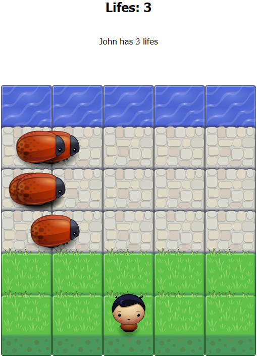

Frontend Nanodegree Arcade Game
===============================

## Getting Started

It's simple ! You need clone the project and open index.html in you browser !

```bash
git clone https://github.com/mrangel-jr/frontend-nanodegree-arcade-game.git
cd frontend-nanodegree-arcade-game
open index.html
```

## How play the game ??

Did you see the game ??



This is John !! Your goal is avoid the collision with bugs and get to the water. When you complete it, you get one life !! However, if any bug catch you, you lose one life.

